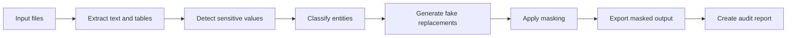

# Local Data Masker

A local-first data masking tool for replacing sensitive real-world data with plausible fake data in PDFs, tables, and other document sources.

> **Status:** Phase 1 (structured data prototype) implemented  
> **Core idea:** turn real personal, organizational, and content-specific data into realistic but fictional alternatives without sending files to external services.

---

## Getting started

```bash
python3 -m venv .venv
source .venv/bin/activate
pip install -e ".[dev]"

# Mask a CSV/XLSX file or a folder of them
local-data-masker mask examples/sample_input.csv --output masked.csv --report report.json

# Detect findings without writing any output
local-data-masker scan examples/sample_input.csv --report findings.json

# Run the test suite
pytest
```

Phase 1 currently detects and masks `name`, `email`, `phone`, `iban`, `date` / `date_of_birth`, and `id`-style columns in CSV and Excel files, based on column-name heuristics with a value-shape fallback for unlabeled columns. Unrecognized columns (e.g. `course_title`) are left untouched. Use `--consistent` together with `--mapping` to reuse the same fake value for repeated originals across runs.

---

## Why this project exists

Sensitive data is often not stored neatly in tables. It may appear in PDFs, exported reports, forms, learning documents, spreadsheets, screenshots, or mixed text sources.

This project aims to provide a local tool that can extract sensitive information from different sources and replace it with believable fake data while keeping the document readable and useful.

Examples:

| Original | Masked |
|---|---|
| `Ben Miller` | `John Winter` |
| `1975/02/21` | `1976/03/20` |
| `Course: Money Laundering` | `Course: Healthy Nutrition` |
| `ben.miller@example.com` | `john.winter@example.test` |
| `Employee ID: 481927` | `Employee ID: 735204` |

The goal is not simply to redact data with black bars. The goal is to create **safe, realistic substitute data** that can still be used for demos, testing, documentation, e-learning examples, or portfolio pieces.

---

## What “masking” means here

This project focuses on **data masking**.

Data masking means that real values are replaced by artificial values. The output should look realistic, but it should no longer reveal the original person, customer, course, organization, or business case.

This is different from simple anonymization or redaction:

- **Redaction** removes or hides information.
- **Pseudonymization** replaces data but may keep a reversible mapping.
- **Anonymization** aims to make re-identification impossible.
- **Masking** replaces sensitive values with plausible fake values while preserving usefulness.

The first versions of this project should be treated as a **local masking and pseudonymization tool**, not as a legal guarantee of full anonymization.

---

## Planned input sources

- PDF files
- CSV files
- Excel files
- Plain text files
- DOCX files
- Later: scanned PDFs and images via OCR

---

## Planned masking categories

The tool should be able to detect and replace different kinds of sensitive information.

### Personal data

- names
- dates of birth
- email addresses
- phone numbers
- postal addresses
- employee IDs
- customer IDs
- insurance numbers
- IBANs

### Organizational data

- company names
- departments
- locations
- project names
- customer names
- supplier names

### Content-specific data

- course titles
- training names
- case study topics
- document titles
- product names
- internal process names
- medical, HR, legal, or compliance-related terms

Example:

```text
Original:
Ben Miller completed the course "Money Laundering" on 1975/02/21.

Masked:
John Winter completed the course "Healthy Nutrition" on 1976/03/20.
```

---

## Key idea: semantic replacement

The project should not only detect technical patterns such as emails or phone numbers. It should also support semantic replacement.

That means:

- a person should become another plausible person,
- a date should become another plausible date,
- a course title should become another harmless but realistic course title,
- a medical topic should become another safe medical topic if the context requires it,
- an internal project name should become a fictional project name,
- the original document should remain coherent.

Example:

```text
Original:
Maria Schneider attended the course "Anti-Corruption and Money Laundering Prevention".

Masked:
Laura Weber attended the course "Workplace Health and Healthy Nutrition".
```

---

## Masking modes

### 1. Consistent masking

The same original value is always replaced with the same fake value within one project.

Example:

```text
Ben Miller -> John Winter
Ben Miller -> John Winter
Ben Miller -> John Winter
```

This is useful when relationships in the document must remain understandable.

### 2. One-off masking

Each occurrence may receive a different fake value.

Example:

```text
Ben Miller -> John Winter
Ben Miller -> Daniel Brooks
Ben Miller -> Peter Howard
```

This is useful when strict consistency is not needed.

### 3. Rule-based masking

The user can define custom replacements.

Example:

```yaml
custom_replacements:
  "Money Laundering": "Healthy Nutrition"
  "Internal Audit": "Learning Review"
  "Acme GmbH": "Example Industries GmbH"
```

### 4. Category-based masking

The tool replaces values based on categories.

Example:

```yaml
categories:
  course_compliance:
    replacements:
      - Healthy Nutrition
      - Workplace Safety Basics
      - Digital Collaboration
      - Ergonomics at Work
```

---

## Intended workflow



---

## Example CLI concept

Scan a folder and create a findings report:

```bash
local-data-masker scan ./input --report findings.json
```

Mask all supported files in a folder:

```bash
local-data-masker mask ./input --output ./output --consistent
```

Mask a single PDF:

```bash
local-data-masker mask document.pdf --output document_masked.pdf
```

Use a custom masking profile:

```bash
local-data-masker mask ./input --profile ./profiles/healthcare-demo.yaml --output ./output
```

Run a dry run without changing files:

```bash
local-data-masker mask ./input --dry-run --report preview.json
```

---

## Possible project structure

```text
local-data-masker/
├── README.md
├── pyproject.toml
├── src/
│   └── local_data_masker/
│       ├── __init__.py
│       ├── cli.py
│       ├── extractors/
│       │   ├── pdf_extractor.py
│       │   ├── table_extractor.py
│       │   ├── docx_extractor.py
│       │   └── text_extractor.py
│       ├── detectors/
│       │   ├── regex_detector.py
│       │   ├── ner_detector.py
│       │   ├── semantic_detector.py
│       │   └── custom_rules.py
│       ├── maskers/
│       │   ├── faker_provider.py
│       │   ├── semantic_replacer.py
│       │   ├── mapping_store.py
│       │   └── replacer.py
│       ├── exporters/
│       │   ├── pdf_exporter.py
│       │   ├── table_exporter.py
│       │   ├── docx_exporter.py
│       │   └── report_exporter.py
│       └── config/
│           └── default_rules.yaml
├── profiles/
├── tests/
├── examples/
└── docs/
```

---

## Privacy and security principles

This project should follow these principles from the start:

- **Local-first:** no cloud upload and no external API calls by default.
- **No telemetry:** the tool should not collect usage data.
- **No sensitive logs:** original values must not be written to normal logs.
- **Dry-run mode:** users should be able to inspect findings before masking.
- **Auditability:** replacements should be traceable in a local report.
- **Configurable rules:** users should be able to define custom detection and replacement rules.
- **Fail-safe behavior:** uncertain detections should be flagged for review instead of silently ignored.
- **Optional mapping file:** consistent masking may require a local mapping file, which must be treated as sensitive.

---

## Audit report concept

The tool should create a local report such as:

```json
{
  "source_file": "example.pdf",
  "masked_file": "example_masked.pdf",
  "replacements": [
    {
      "category": "person_name",
      "original": "Ben Miller",
      "masked": "John Winter",
      "confidence": 0.98
    },
    {
      "category": "date_of_birth",
      "original": "1975/02/21",
      "masked": "1976/03/20",
      "confidence": 0.95
    },
    {
      "category": "course_title",
      "original": "Money Laundering",
      "masked": "Healthy Nutrition",
      "confidence": 0.91
    }
  ]
}
```

For highly sensitive use cases, the report should optionally omit original values.

---

## Early technical direction

Possible Python libraries:

- `pandas` / `openpyxl` for tables
- `python-docx` for DOCX files
- `PyMuPDF` or `pdfplumber` for PDFs
- `Faker` for synthetic names, addresses, dates, emails, and phone numbers
- `presidio-analyzer` and `presidio-anonymizer` as possible inspiration or optional backend
- local NLP models for named entity recognition
- local LLM or rule-based semantic replacement for content-specific terms
- `typer` or `click` for the CLI
- `pytest` for testing

The exact stack is still open and should be validated with small prototypes.

---

## Roadmap

### Phase 1: Structured data prototype

- Read CSV and Excel files
- Detect names, emails, phone numbers, IDs, and dates
- Replace values with fake data
- Export masked CSV/XLSX files
- Generate JSON audit report

### Phase 2: Custom replacement profiles

- Add YAML-based replacement rules
- Support project-specific masking categories
- Add consistent replacement via local mapping store

### Phase 3: PDF text extraction

- Extract text from normal PDFs
- Detect sensitive values in extracted text
- Replace values in text output
- Evaluate PDF reconstruction options

### Phase 4: Semantic masking

- Detect course titles, project names, company names, and sensitive topics
- Replace them with harmless but realistic alternatives
- Preserve document coherence across multiple pages and files

### Phase 5: Review workflow

- Add a review report
- Mark uncertain detections
- Add allowlist and blocklist support
- Add manual approval before export

### Phase 6: OCR and visual documents

- Add OCR support for scanned PDFs and images
- Detect personal data in OCR text
- Explore visual redaction overlays or PDF layer replacement

### Phase 7: User interface

- Add a simple local web interface or desktop UI
- Support drag-and-drop input
- Show findings before masking
- Export masked documents and reports

---

## Non-goals for the first version

The first version will not attempt to:

- guarantee legal anonymization,
- process every complex PDF layout perfectly,
- replace professional privacy review,
- upload documents to cloud-based AI services,
- hide sensitive data by merely drawing black boxes over text without removing the underlying content.

---

## Example use cases

- preparing masked demo data,
- creating realistic training examples,
- cleaning customer exports before internal testing,
- replacing personal data in PDFs before sharing,
- generating safer portfolio screenshots or documentation,
- converting sensitive real-world examples into harmless fictional examples.

---

## Suggested repository name

```text
local-data-masker
```

Alternative names:

```text
semantic-data-masker
pii-data-masker
document-data-masker
local-pii-masker
safe-data-masker
```

---

## License

License to be decided.
