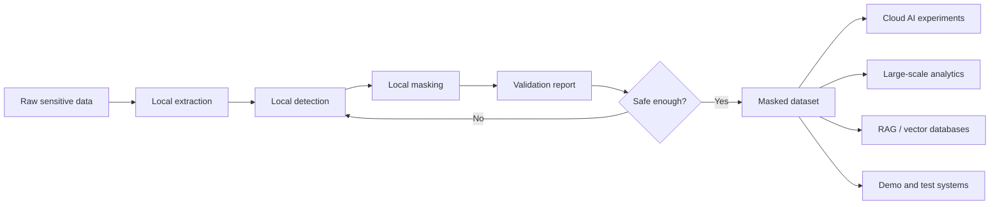
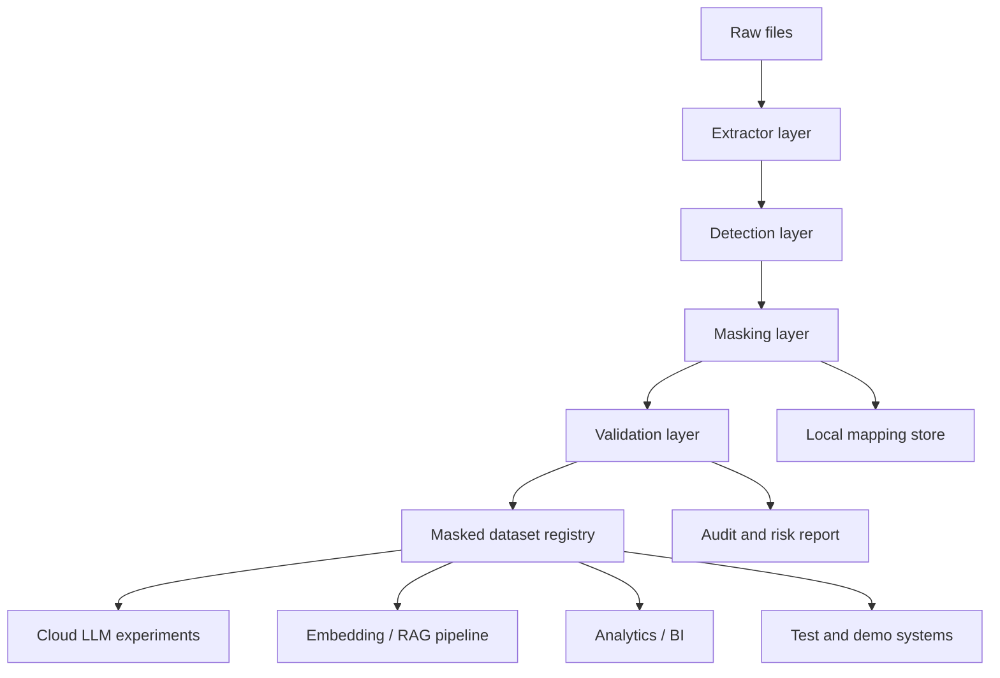

# Cloud AI Workflow Vision

`local-data-masker` is not meant to keep every downstream workflow local forever.

The project goal is to create a **local safety gateway** that transforms sensitive real-world data into masked, realistic, and useful datasets. These masked datasets can then be used for experimentation with large datasets, cloud-based AI services, analytics pipelines, RAG systems, and prototype applications.

---

## Core idea

Raw sensitive data should stay in the protected local environment.

Only masked, validated, and reviewed data should leave that environment.



---

## Three-zone model

### Zone 1: Raw data zone

Contains original files and sensitive values.

Examples:

- PDFs
- Excel files
- CSV exports
- HR or customer records
- course data
- audit reports
- medical, legal, financial, or compliance-related material

Rules:

- stays local
- no cloud upload
- no external AI API calls
- no telemetry
- no accidental logging of original values

### Zone 2: Masking and validation zone

The local processing layer.

Responsibilities:

- extract text and tables
- detect sensitive values
- apply deterministic or semantic masking
- preserve useful structure
- generate validation reports
- flag uncertain detections
- allow manual review

This is the core responsibility of `local-data-masker`.

### Zone 3: Experimentation zone

Contains masked datasets that are safe enough for broader experimentation.

Possible use cases:

- cloud LLM experiments
- RAG and vector database tests
- embedding model comparisons
- classification and clustering experiments
- data analytics workflows
- synthetic demo datasets
- e-learning prototypes
- portfolio screenshots
- load testing with realistic-looking data

---

## Why masking must preserve usefulness

For cloud AI experiments, simple redaction is often not enough.

Bad output:

```text
[REDACTED] completed [REDACTED] on [REDACTED].
```

Useful masked output:

```text
John Winter completed Healthy Nutrition on 1976/03/20.
```

The second version still supports:

- text classification
- summarization
- RAG retrieval
- embedding experiments
- UI testing
- dashboard prototyping
- realistic demos

That is why this project focuses on **realistic substitute data**, not only removal.

---

## Design principles for cloud-readiness

### 1. Local-first masking, cloud-ready output

The masking process should run locally, but the output should be useful for cloud systems.

### 2. Validation before upload

A masked dataset should not automatically be considered safe. The tool should produce validation reports and eventually support review workflows.

### 3. Separation of raw and masked storage

Raw inputs, mapping files, and masked outputs should live in clearly separated folders.

Suggested layout:

```text
project-data/
├── raw/              # never upload
├── profiles/         # generic masking rules, usually safe
├── mappings/         # sensitive, never upload
├── reports/          # review carefully before sharing
└── masked/           # candidate output for cloud experiments
```

### 4. Mapping files are secrets

Consistent masking can require mapping files. These files link original values to fake values and must be treated like secrets.

They should not be committed, uploaded, or shared.

### 5. Huge datasets require streaming/chunking

Large data support should avoid loading everything into memory at once.

Future directions:

- chunked CSV processing
- batch-wise Excel handling where possible
- Parquet support
- resumable jobs
- progress reporting
- processing manifests
- per-file and per-batch reports

### 6. Cloud experiments should use masked-only interfaces

Future integrations should be designed so cloud connectors receive only masked data.

Examples:

- masked CSV to cloud storage
- masked chunks to embedding APIs
- masked documents to vector databases
- masked batches to LLM evaluation pipelines

---

## Future architecture direction



---

## Recommended next technical milestones

### Milestone 1: Dataset manifests

Add a manifest that records:

- source files
- masked output files
- profile used
- run timestamp
- detected categories
- number of replacements
- report location
- whether originals are included in the report

### Milestone 2: Batch processing for large CSV files

Add chunked processing so huge CSV files can be masked without loading the full file into memory.

### Milestone 3: Parquet support

Parquet is useful for large-scale analytics and cloud workflows.

### Milestone 4: Validation scoring

Add a risk score that estimates whether sensitive data may still remain in the masked output.

### Milestone 5: Cloud export adapters

Add optional export adapters that only accept masked outputs, for example:

- local folder export
- cloud-storage-ready folder export
- vector-ingestion export
- LLM-evaluation dataset export

### Milestone 6: Review UI

Before cloud upload, users should be able to inspect findings and masked samples.

---

## Non-goal

The tool should not upload raw sensitive data to cloud AI services.

Cloud experimentation is a downstream use case for **masked and validated datasets only**.
